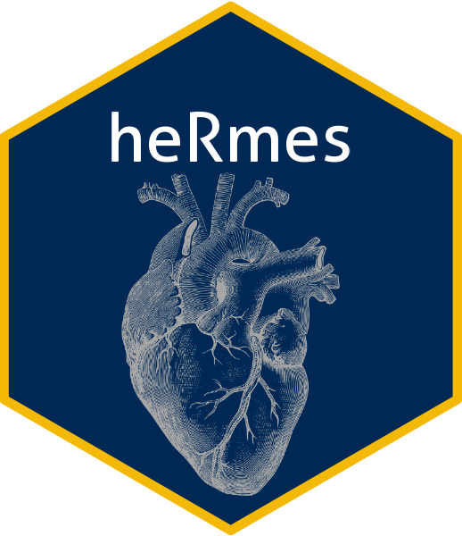

<!-- README.md is generated from README.Rmd. Please edit that file -->

```{r, include = FALSE}
knitr::opts_chunk$set(
  collapse = TRUE,
  comment = "#>",
  fig.path = "man/figures/README-",
  out.width = "100%"
)
```

# heRmes 
```{r setup, include = FALSE}
library(heRmes)
```

<!-- badges: start -->
[](https://github.com/nicksunderland/heRmes/actions/workflows/R-CMD-check.yaml)
<!-- badges: end -->

The goal of **heRmes** is to standardise the heart failure phenotyping of collections of electronic health records. 

## Installation

You can install the latest version of **heRmes** like so:

``` r
# install.packages("devtools")
devtools::install_github("nicksunderland/heRmes")
```

## Phenotypes
The code lists underpinning the various phenotypes are stored in text files within the package structure at: `inst/extdata/ukhdr_phenotypes`. The format of the file matches that used by the [UKHDR Phenotype Library](https://phenotypes.healthdatagateway.org), but the important columns are: `code`,	`description`, `coding_system.name`, `phenotype_id` and `phenotype_name`. Below is an example of how to view the available phenotypes and obtain the codes.  

### Avaiable phenotypes
For example, view the first 6 phenotypes. 
```{r ids}
get_phenotypes()[1:5]
```

### Codes
View the codes for phenotype `PH_HF_HERMES_3.0`.
```{r codes}
# top 5 codes
get_codes(pheno_id = "PH_HF_HERMES_3.0")[1:5, c("phenotype_id", "phenotype_name", "coding_system.name", "code")]
```

### Phenotyping a dataset
Create sample data in long format (multiple ID entries per asscoaited EHR code).
```{r create_data}
set.seed(2020)
n   <- 10
dat <- data.frame(ids   = paste0("ID_", c(1:(n/2), 1:(n/2))), 
                  codes = sample(c("I420", "foo", "bar", "baz"), n, replace = TRUE))
dat
```

Phenotype the individuals with phenotype `PH_HF_HERMES_3.0`, excluding phenotype `PH_congHD_HERMES_3.0`. There can be multiple included or excluded phenotypes given in a list. 
```{r phenotype}
result <- phenotype(dat$ids, dat$codes, 
                    name    = "Heart Failure", 
                    include = list("PH_HF_HERMES_3.0"), 
                    exclude = list("PH_congHD_HERMES_3.0"))
result[]
```

### Update library from UKHDR
The package phenotype library can be updated from the [UKHDR Phenotype Library API](https://phenotypes.healthdatagateway.org/api/v1/) using the below function. This queries the library for phenotypes matching enteries in the `search_terms` argument. 
```{r update, eval = TRUE}
update_library(search_terms = c("heart failure", "cardiomyopathy", "myocardial infarction"))
```

### Plotting phenotype 
To see the intersection of the codes in two or more phenotype files use the `plot_code_overlap()` function. 
```{r plot}
# under development
# plot_code_overlap(pheno_ids = c("PH_DCM_HERMES_3.0", "PH1002"))
```

