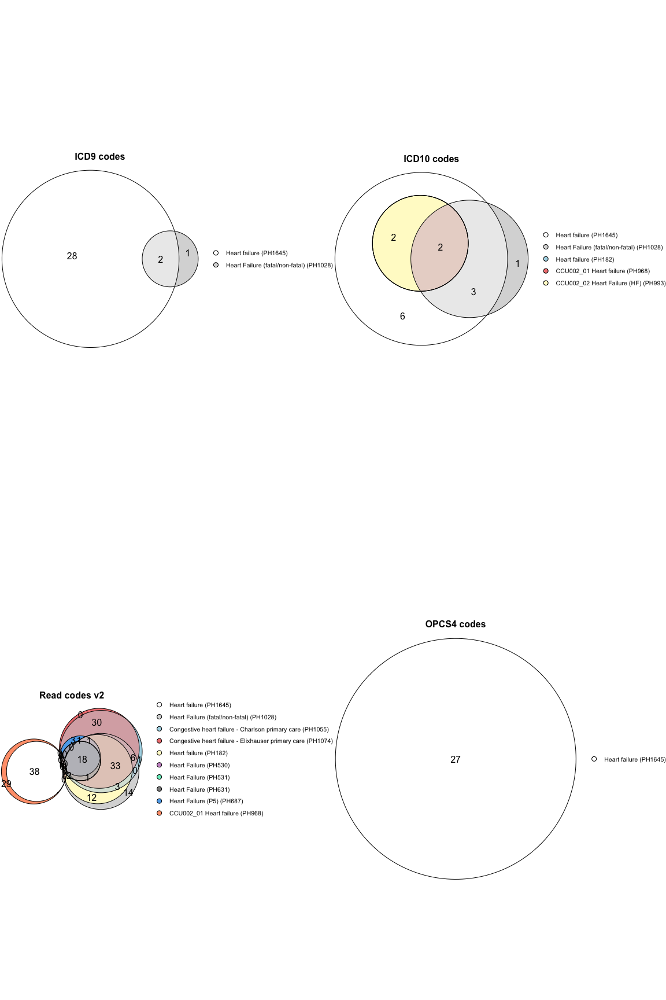
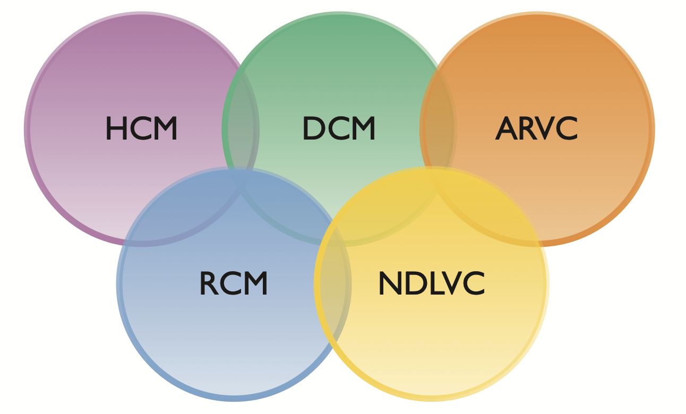

<!-- README.md is generated from README.Rmd. Please edit that file -->

# heRmes 

<!-- badges: start -->
<!-- badges: end -->

The goal of **heRmes** is to standardise the heart failure phenotyping
of collections of electronic health records.

## Installation

You can install the latest version of **heRmes** like so:

``` r
# install.packages("devtools")
devtools::install_github("nicksunderland/heRmes")
```

## Phenotypes

The code lists underpinning the various phenotypes are stored in text
files within the package structure at: `inst/extdata/ukhdr_phenotypes`.
The format of the file matches that used by the [UKHDR Phenotype
Library](https://phenotypes.healthdatagateway.org), but the important
columns are: `code`, `description`, `coding_system.name`, `phenotype_id`
and `phenotype_name`. Below is an example of how to view the available
phenotypes and obtain the codes.

### Avaiable phenotypes

For example, view the first 5 phenotypes.

``` r
get_phenotypes()[1:5]
#>                         CCU002_02 Cardiomyopathy 
#>                                         "PH1002" 
#>                Acute Myocardial Infarction (AMI) 
#>                                         "PH1024" 
#>                  Heart Failure (fatal/non-fatal) 
#>                                         "PH1028" 
#> Congestive heart failure - Charlson primary care 
#>                                         "PH1055" 
#>    Myocardial infarction - Charlson primary care 
#>                                         "PH1062"
```

### Codes

View the codes for `PH1645` corresponding to the HERMES Heart Failure
phenotype.

``` r
# top 5 codes
get_codes(pheno_id = "PH1645")[1:5, c("phenotype_id", "phenotype_name", "coding_system.name", "code")]
#>    phenotype_id phenotype_name coding_system.name   code
#>          <char>         <char>             <char> <char>
#> 1:       PH1645  Heart failure         ICD9 codes  40201
#> 2:       PH1645  Heart failure         ICD9 codes  42832
#> 3:       PH1645  Heart failure         ICD9 codes  42821
#> 4:       PH1645  Heart failure         ICD9 codes  42823
#> 5:       PH1645  Heart failure         ICD9 codes  42820
```

### Phenotyping a dataset

Create sample data. This can be in long (only one column containing
diagnosis codes) or wide format (multiple columns containing diagnosis
codes). *n.b. prioritising coding based on diagnosis code position
(e.g. primary vs. secondary vs. tertiary positions) is not currently
supported.*

``` r
set.seed(2020)
n   <- 10
dat <- data.frame(ids   = paste0("ID_", c(1:(n/2), 1:(n/2))), 
                  codes = sample(c("I420", "foo", "bar", "baz"), n, replace = TRUE), 
                  codes1 = sample(c("I420", "foo", "bar", "baz"), n, replace = TRUE))
dat
#>     ids codes codes1
#> 1  ID_1   baz   I420
#> 2  ID_2   baz   I420
#> 3  ID_3   bar    baz
#> 4  ID_4   foo    baz
#> 5  ID_5   baz    baz
#> 6  ID_1  I420    foo
#> 7  ID_2  I420    foo
#> 8  ID_3   baz    baz
#> 9  ID_4   foo    foo
#> 10 ID_5   foo   I420
```

Phenotype the individuals with phenotype `PH1643` (heart failure
syndrome) or `PH1646` (cardiomyopathy), excluding phenotypes `PH1637`
(congenital heart disease) and `PH1636` (myocardial infarction). There
can be multiple included or excluded phenotypes given in a list.

``` r
result <- phenotype(x         = dat, 
                    id_col    = "ids",
                    code_cols = list("ICD10 codes" = c("codes", "codes1")), 
                    include   = list("PH1645"), 
                    exclude   = list("PH1637"))
#> Phenotyping...
#> [i] processing 10 records
#> [i] pivoting data longer
#> [i] getting inclusion phenotype codes from PhenoID(s) PH1645 
#> [i] getting exclusion phenotype codes from PhenoID(s) PH1637 
#> [i] assessing phenotype PH1645 
#> [i] assessing phenotype PH1637 
#> [i] summarising phenotyping of participants
#> [i] finished
```

``` r
result[]
#>       ids PH1645 PH1637   none include exclude overall
#>    <char> <lgcl> <lgcl> <lgcl>  <lgcl>  <lgcl>  <lgcl>
#> 1:   ID_1  FALSE  FALSE   TRUE   FALSE   FALSE   FALSE
#> 2:   ID_2  FALSE  FALSE   TRUE   FALSE   FALSE   FALSE
#> 3:   ID_3  FALSE  FALSE   TRUE   FALSE   FALSE   FALSE
#> 4:   ID_4  FALSE  FALSE   TRUE   FALSE   FALSE   FALSE
#> 5:   ID_5  FALSE  FALSE   TRUE   FALSE   FALSE   FALSE
```

#### Code formatting issues

Many of the coding systems have slight formating differences - for
example an ICD-10 code may appear as `I509` or `I50.9` in a dataset. The
`phenotype()` provides a way to clean these codes through use of the
`gsub` argument. This takes a 3 element list: \[\[1\]\] is a string
representing the regular expression pattern, \[\[2\]\] is the
replacement string, and \[\[3\]\] is a character or character vector
which can be one or more of: `x` (apply to codes in `x`), `pheno` (apply
to all codes in phenotypes), `both` (apply to everything), or a valid
phenotype ID found in `include` or `exclude` (apply to specific
phenotype datasets). Other arguments can be passed to `gsub` through
`...`.

It is important to inspect your dataset (`x`) and phenotype coding (use
`get_codes()`) prior to running the phenotyping to avoid join issues
related to formatting differences.

Output formatting can be changed by altering the inputs. If the
phenotype IDs are named, these names are used as column names in the
result. The overall result is given in the column `overall`, although
this can be renamed by giving the `name` parameter.

``` r
# change format
dat[10, "codes1"] <- "I42.0"
dat[]
#>     ids codes codes1
#> 1  ID_1   baz   I420
#> 2  ID_2   baz   I420
#> 3  ID_3   bar    baz
#> 4  ID_4   foo    baz
#> 5  ID_5   baz    baz
#> 6  ID_1  I420    foo
#> 7  ID_2  I420    foo
#> 8  ID_3   baz    baz
#> 9  ID_4   foo    foo
#> 10 ID_5   foo  I42.0
```

``` r

# without dealing with the error ID_5 is incorrectly classified as no HF. 
wrong <- phenotype(x         = dat, 
                   id_col    = "ids",
                   code_cols = list("ICD10 codes" = c("codes", "codes1")),
                   include   = list(HF     = "PH1645"), 
                   exclude   = list(congHD = "PH1637"), 
                   name      = "Heart Failure")
#> Phenotyping...
#> [i] processing 10 records
#> [i] pivoting data longer
#> [i] getting inclusion phenotype codes from PhenoID(s) PH1645 
#> [i] getting exclusion phenotype codes from PhenoID(s) PH1637 
#> [i] assessing phenotype PH1645 
#> [i] assessing phenotype PH1637 
#> [i] summarising phenotyping of participants
#> [i] finished
```

``` r
wrong[]
#>       ids     HF congHD   none include exclude Heart Failure
#>    <char> <lgcl> <lgcl> <lgcl>  <lgcl>  <lgcl>        <lgcl>
#> 1:   ID_1  FALSE  FALSE   TRUE   FALSE   FALSE         FALSE
#> 2:   ID_2  FALSE  FALSE   TRUE   FALSE   FALSE         FALSE
#> 3:   ID_3  FALSE  FALSE   TRUE   FALSE   FALSE         FALSE
#> 4:   ID_4  FALSE  FALSE   TRUE   FALSE   FALSE         FALSE
#> 5:   ID_5  FALSE  FALSE   TRUE   FALSE   FALSE         FALSE
```

``` r

# deal with formatting issue using gsub
pheno <- phenotype(x         = dat, 
                   id_col    = "ids",
                   code_cols = list("ICD10 codes" = c("codes", "codes1")),
                   include   = list(HF     = "PH1645"), 
                   exclude   = list(congHD = "PH1637"), 
                   gsub      = list("\\.", "", c("x")),
                   name      = "Heart Failure")
#> Phenotyping...
#> [i] processing 10 records
#> [i] pivoting data longer
#> [i] cleaning input codes with regex [ \. ], replacement [  ]
#> [i] getting inclusion phenotype codes from PhenoID(s) PH1645 
#> [i] getting exclusion phenotype codes from PhenoID(s) PH1637 
#> [i] assessing phenotype PH1645 
#> [i] assessing phenotype PH1637 
#> [i] summarising phenotyping of participants
#> [i] finished
```

``` r
pheno[]
#>       ids     HF congHD   none include exclude Heart Failure
#>    <char> <lgcl> <lgcl> <lgcl>  <lgcl>  <lgcl>        <lgcl>
#> 1:   ID_1  FALSE  FALSE   TRUE   FALSE   FALSE         FALSE
#> 2:   ID_2  FALSE  FALSE   TRUE   FALSE   FALSE         FALSE
#> 3:   ID_3  FALSE  FALSE   TRUE   FALSE   FALSE         FALSE
#> 4:   ID_4  FALSE  FALSE   TRUE   FALSE   FALSE         FALSE
#> 5:   ID_5  FALSE  FALSE   TRUE   FALSE   FALSE         FALSE
```

------------------------------------------------------------------------

### Update library from UKHDR

This package’s phenotype library can be updated from the [UKHDR
Phenotype Library API](https://phenotypes.healthdatagateway.org/api/v1/)
using the below function. This queries the library for phenotypes
matching enteries in the `search_terms` argument.

``` r
update_library(search_terms = c("heart failure", "cardiomyopathy", "myocardial infarction"))
#> [i] reading phenotype id: PH25 - skipping, already exists
#> [i] reading phenotype id: PH182 - skipping, already exists
#> [i] reading phenotype id: PH530 - skipping, already exists
#> [i] reading phenotype id: PH531 - skipping, already exists
#> [i] reading phenotype id: PH631 - skipping, already exists
#> [i] reading phenotype id: PH687 - skipping, already exists
#> [i] reading phenotype id: PH968 - skipping, already exists
#> [i] reading phenotype id: PH993 - skipping, already exists
#> [i] reading phenotype id: PH1028 - skipping, already exists
#> [i] reading phenotype id: PH1055 - skipping, already exists
#> [i] reading phenotype id: PH1074 - skipping, already exists
#> [i] reading phenotype id: PH1603 - skipping, already exists
#> [i] reading phenotype id: PH129 - skipping, already exists
#> [i] reading phenotype id: PH145 - skipping, already exists
#> [i] reading phenotype id: PH185 - skipping, already exists
#> [i] reading phenotype id: PH961 - skipping, already exists
#> [i] reading phenotype id: PH1002 - skipping, already exists
#> [i] reading phenotype id: PH215 - skipping, already exists
#> [i] reading phenotype id: PH356 - skipping, already exists
#> [i] reading phenotype id: PH481 - skipping, already exists
#> [i] reading phenotype id: PH530 - skipping, already exists
#> [i] reading phenotype id: PH611 - skipping, already exists
#> [i] reading phenotype id: PH612 - skipping, already exists
#> [i] reading phenotype id: PH613 - skipping, already exists
#> [i] reading phenotype id: PH741 - skipping, already exists
#> [i] reading phenotype id: PH886 - skipping, already exists
#> [i] reading phenotype id: PH942 - skipping, already exists
#> [i] reading phenotype id: PH949 - skipping, already exists
#> [i] reading phenotype id: PH988 - skipping, already exists
#> [i] reading phenotype id: PH1024 - skipping, already exists
#> [i] reading phenotype id: PH1062 - skipping, already exists
```

------------------------------------------------------------------------

### Update library from UKHDR (unpublished)

This package’s phenotype library can be updated with
unpublished/development phenotypes from the [UKHDR Phenotype Library
API](https://phenotypes.healthdatagateway.org/api/v1/) using the below
function. However, since unpublished phenotypes are not searchable by
name, we need to pass the exact ID and also login details for the
website (stored in a local `.Renviron` file in this example.)

``` r
# development phenotypes, ids named for readability only
hermes_phenos <- c(`Congenital heart disease`    = "PH1637",
                   `Heart failure`               = "PH1645")

# update
update_library(search_terms = c(), 
               ids          = hermes_phenos, 
               UKHDR_UN     = Sys.getenv("UKHDR_UN"), 
               UKHDR_PW     = Sys.getenv("UKHDR_PW"))
```

------------------------------------------------------------------------

### Plotting phenotype

To see the intersection of the codes in two or more phenotype files use
the `plot_code_overlap()` function.

``` r
plot_code_overlap(pheno_ids = c("PH1645", "PH1028", "PH1055", "PH1074", "PH182", "PH25", "PH530", "PH531", "PH631", "PH687", "PH968", "PH993"), 
                  types = c("ICD10 codes", "ICD9 codes", "OPCS4 codes", "Read codes v2"))
```



### ESC primary cardiomyopathy phenotypes

The primary cardiomyopathy phenotypes described in the ESC
cardiomyopathy guidelines.


