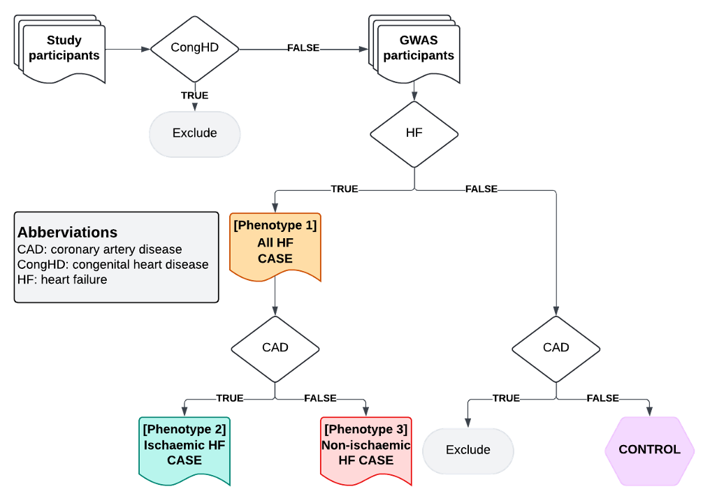

```{r, include = FALSE}
knitr::opts_chunk$set(
  collapse = TRUE,
  comment = "#>"
)
```

```{r setup, echo=FALSE, include=FALSE, eval=FALSE}
library(heRmes)
library(readxl)
library(data.table)
library(glue)
library(irr)

file <- "/Users/xx20081/Library/CloudStorage/OneDrive-SharedLibraries-VUMC/Shaffer, Lauren L - Phenotype Workstream/phenotyping_code_consensus/nih_cardiomyopathy_phenotyping_combined.xlsx"

tabs <- list(HF_IsA                          = "HF_IsA",
             Myocardial_infarction           = "Myocardial_infarction",
             Coronary_artery_bypass_grafting = "Coronary_artery_bypass_grafting",
             Percutaneous_coronary_intervent = "Percutaneous_coronary_intervent",
             Thrombolysis_coronary           = "Thrombolysis_coronary",
             Congenital_heart_disease        = "Congenital_heart_disease", 
             Congenital_heart_procedure      = "Congenital_heart_procedure")

meta <- lapply(tabs, function(x) {
  r <- read_xlsx(file, x, n_max=5, col_names=FALSE)
  d <- data.table()
  d[, r$...1 := lapply(r$...2, function(x) x[[1]])]
}) |> rbindlist(idcol="concept")

dat <- lapply(tabs, function(x) read_xlsx(file, x, skip=13)) |> rbindlist(idcol="concept")
cols <- c("QW","RTL","NS","LL","Concensus")
dat[, (cols) := lapply(.SD, function(x) as.numeric(!is.na(x))), .SDcols = cols]
dat <- dat[Concensus==1 & Source != "SNOMED"]
dat[, agreement := rowSums(.SD)/4, .SDcols = c("QW","RTL","NS","LL")]
dat[meta, Concept := i.Title, on="concept"]

fwrite(dat, "/Users/xx20081/git/heRmes/vignettes/figures/hermes_3_codes_dat.tsv", sep="\t")
fwrite(meta, "/Users/xx20081/git/heRmes/vignettes/figures/hermes_3_metadata_dat.tsv", sep="\t")

fwrite(dat[, .(Concept, Code, Source, Description)], "/Users/xx20081/git/heRmes/inst/extdata/hermes_3_codes/hermes_3_codes.tsv", sep="\t")

fwrite(meta[, .(Concept=Title, Definition, Reference, Terminologies, `Search expressions`)], "/Users/xx20081/git/heRmes/inst/extdata/hermes_3_codes/hermes_3_metadata.tsv", sep="\t")

```

```{r heatmaps, echo=FALSE, include=FALSE, eval=FALSE}
library(data.table)
library(ggplot2)
library(hfphenotyping)

counts <- rbindlist(list("UK Biobank"  = ukbb_counts[, c("code", "code_type", "count")], 
                         "NHS England" = nhs_counts[, c("code", "code_type", "count")], 
                         "BioVU"       = biovu_counts[, c("code", "code_type", "count")]), idcol = "cohort")
counts <- counts[, .(count=sum(count)), by=c("cohort","code","code_type")]
heat_dat <- lapply(split(counts, by="cohort"), function(x) { dat[x, .(concept, Concept, Code, Source, Count = i.count), on = c("Code"="code", "Source"="code_type"), nomatch = NULL] 
})|> rbindlist(idcol="cohort")

heat_dat <- heat_dat[order(cohort, Count)][, Code := factor(Code, levels = unique(Code))]
heat_dat[, Source := factor(Source, levels=unique(Source))]
heat_dat[, cohort := factor(cohort, levels=unique(cohort))]

for (con in unique(dat$concept)) {
  p <- ggplot(heat_dat[concept==con & Count>10], aes(x=Count, y=Code, fill=log(Count))) +
    geom_col(position = position_dodge(width=1)) +
    theme_bw(base_size=14) +
    theme(legend.position = "none", 
          axis.text.y = element_text(size=8)) +
    facet_wrap(Source~cohort, scales = "free")
    
  png(paste0("/Users/xx20081/git/heRmes/vignettes/figures/counts_", con, ".png"), height=700, width=700)
  print(p)
  dev.off()
}
```


## Aim  
To perform a multi-ancestry sex-stratified genome-wide association study (GWAS) meta-analysis of HF, ischaemic HF and non-ischaemic HF. 

## Download codes 

To download the codes and search strategies clink the links:

<a href="https://github.com/nicksunderland/heRmes/tree/main/inst/extdata/hermes_3_codes/hermes_3_codes.tsv" download>
  <button style="background-color: #002855; color: white; padding: 10px 20px; border: none; border-radius: 5px; text-align: center; text-decoration: none; display: inline-block; font-size: 12px;">
    Download hermes_3_codes.tsv
  </button>
</a>

<a href="https://github.com/nicksunderland/heRmes/tree/main/inst/extdata/hermes_3_codes/hermes_3_metadata.tsv" download>
  <button style="background-color: #002855; color: white; padding: 10px 20px; border: none; border-radius: 5px; text-align: center; text-decoration: none; display: inline-block; font-size: 12px;">
    Download hermes_3_metadata.tsv
  </button>
</a>


## Rationale  
Heart failure (HF) has shown substantial sex differences in its clinical presentations and risk profiles, but much remains unclear about HF in women.[@groenewegenEpidemiologyHeartFailure2020; @heidenreich2022AHAACC2022; @kenchaiahHeartFailureWomen2015] Sex-stratified genome-wide association studies (GWAS) have provided mechanistic insights into diseases with known phenotypic sex differences.[@cardiogramplusc4dconsortiumLargescaleAssociationAnalysis2013; @boerDecipheringOsteoarthritisGenetics2021] This project aims to identify sex-specific HF risk loci, by performing a sex-stratified GWAS of all-cause HF and subtypes stratified by ischaemic aetiology, including an analysis of the X chromosome (ChrX). This research, particularly the analysis of non-ischaemic HF, is envisioned to build new knowledge on the sex-specific genetic basis of HF and identify non-traditional risk factors.  

HF amongst individuals with congenital heart disease represents a distinct entity, largely due to structural malformations during embryonic cardiogenesis. Whilst most cases remain unexplained, genetic association studies have highlighted variants in important patterning genes as potential causal factors.[@lahmCongenitalHeartDisease2021] In this study, we are interested in why hearts that seemingly developed normally then go on to fail. Given the often dramatic structural abnormalities seen in congenital heart disease and likely distinct pathophysiology (embryonic patterning), we have excluded this subgroup from our HF definition.  

Chronic respiratory disease, predominantly COPD, is a common comorbidity amongst patients with diagnosed HF.[@ehteshami-afsharClinicalCharacteristicsOutcomes2021] Whilst outcomes are poorer in this HF subgroup, standard HF therapeutics offer similar prognostic benefits suggesting shared underlying pathophysiological mechanisms.[@ehteshami-afsharClinicalCharacteristicsOutcomes2021] Diagnosis of either, or both, conditions can be challenging due to overlapping clinical signs and symptoms. However, chronic respiratory disease and HF share multiple upstream risk factors - smoking being the most obvious - therefore conditioning on chronic respiratory disease status has the potential to induce bias in the data. Therefore, we have not excluded chronic respiratory disease patients from our HF definition, as long as they also have a definite, non-ambiguous, HF diagnostic code.  

## Study phenotypes

| Phenotype   | Name             | Brief Description                                       |
|-------------|------------------|---------------------------------------------------------|
| Phenotype 1 | All HF           | Clinical syndrome of HF, any cause or manifestation     |
| Phenotype 2 | Ischaemic HF     | HF comorbid with antecedent CAD                         |
| Phenotype 3 | Non-ischaemic HF | HF without CAD                                          |

## Methods  
*Subjects:* Individuals of European, South Asian, East Asian, African, Hispanic, and Indigenous American ancestries who are free of congenital heart disease, and with or without prevalent HF.  

*Genotypes:* Autosomal and ChrX SNPs (preferably imputed against HRC, TOPMED, or population-specific haplotypes).  

*Phenotypes:* Three phenotypes as described above (minimum of 500 cases and 500 controls in each sex for each ancestry-specific GWAS analysis).  


## Return of results  
The Cardiovascular Knowledge Portal team have developed a private data repository for HERMES3 with functionality to validate file formats and run QC on cohort-level GWAS summary data. Please also return results for your study to the analysis team at UQ via the UQRDM. To get access to UQRDM, please provide your analyst email address to Clara Jiang at j.jiang@uq.edu.au.


## Phenotype definition
To define phenotypes in your study, please follow a two-step approach described below: 

### Step 1  
For each participant, define the status (TRUE / FALSE) for the following phenotype classifiers: 

| Classifier              | Classifier ID | Description                                                                 |
|-------------------------|---------------|-----------------------------------------------------------------------------|
|Congenital heart disease | CongHD        | Any congenital malformation of the heart or great vessels defined by a diagnosis, or relevant surgical or percutaneous procedure |
|Heart failure            | HF            | Diagnosis of heart failure of any cause                                     |
|Coronary artery disease  | CAD           | Diagnosis of myocardial infarction, history of coronary thrombolysis procedure and surgical or percutaneous procedure for coronary artery revascularization |

Where available, manually adjudicated clinical definitions made by trained physicians are preferred.  

For de novo adjudication using electronic health records, please define these classifiers as the presence of at least 1 relevant diagnosis/procedure code listed in Appendix Ia-c. Where appropriate, please also include other code systems (e.g. READ and CPT) by mapping the recommended codes.  

If self-reported data are available, individuals who lack a HF or CAD diagnosis/procedure code, but self-report to have had these conditions, should be excluded from the study.   

Please contact the central analyst team for cohort-specific adjudication not mentioned here.  

### Step 2   
For each participant, classify the status (case/control/exclude) for target GWAS phenotypes by combining classifier status from Step 1 using the logic described below.  

*Table 1. GWAS Phenotype classifiers for all-cause HF, ischaemic HF, and non-ischaemic HF (phenotypes 1-3)*  

| CongHD | HF   | CAD   | Category                | Phenotype |
|--------|------|-------|-------------------------|-----------|
| TRUE   | ANY  | ANY   | Exclude                 |           |
| FALSE  | TRUE | TRUE  | Ischaemic HF case       |1 & 2      |
| FALSE  | TRUE | FALSE | Non-ischaemic HF case   |1 & 3      |
| FALSE  | FALSE| TRUE  | Exclude                 |           |
| FALSE  | FALSE| FALSE | CONTROL                 |           |

*Figure 1. Phenotyping algorithm*  




```{r gen, echo=FALSE, results='asis', message=FALSE, warning=FALSE}
library(data.table)
library(glue)
library(knitr)
library(here)

dat <- fread(here("vignettes/figures/hermes_3_codes_dat.tsv"))
meta <- fread(here("vignettes/figures/hermes_3_metadata_dat.tsv"))

for (con in unique(dat$concept)) {
  m0 <- meta[concept==con]
  d0 <- dat[concept==con]
  
  str <- glue("---
  
  ## {m0$Title} \n
    **Definition:**          {m0$Definition}. \n
    **Reference:**           {m0$Reference}. \n
    **Terminologies:**      `{m0$Terminologies}`. \n
    **Search expressions:** `{m0$`Search expressions`}`. \n

    <center>
    
    
    
    </center>
    

")
  
  # the text
  cat(str)
  
  # the table 
  print(kable(d0[Source != "SNOMED", .(Code, Source, Description)]))
  
  
}

```

## References  
