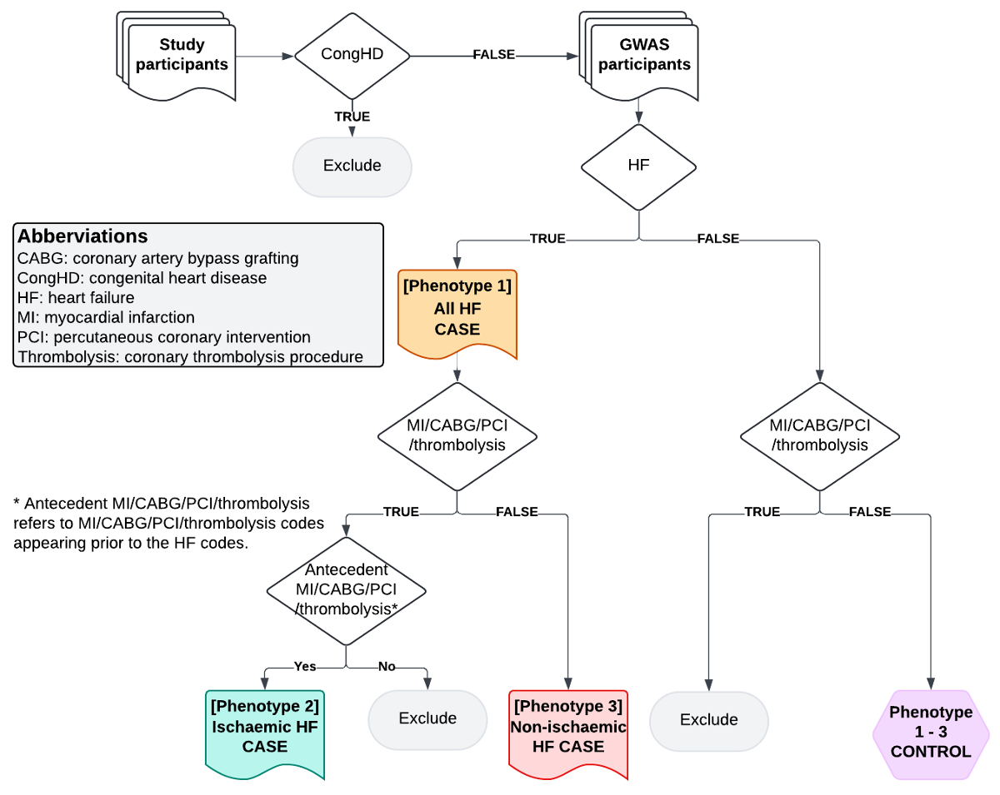
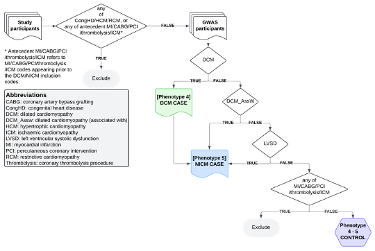

```{r, include = FALSE}
knitr::opts_chunk$set(
  collapse = TRUE,
  comment = "#>"
)
```

```{r setup, echo=FALSE, include=FALSE, eval=FALSE}
library(heRmes)
library(readxl)
library(data.table)
library(glue)
library(irr)

file <- "/Users/xx20081/Library/CloudStorage/OneDrive-SharedLibraries-VUMC/Shaffer, Lauren L - Phenotype Workstream/phenotyping_code_consensus/nih_cardiomyopathy_phenotyping_combined.xlsx"

tabs <- list(HF_IsA                          = "HF_IsA",
             DCM_IsA                         = "DCM_IsA",
             DCM_AssociatedWith              = "DCM_AssociatedWith",
             LVSD_IsA                        = "LVSD_IsA",
             Myocardial_infarction           = "Myocardial_infarction",
             Coronary_artery_bypass_grafting = "Coronary_artery_bypass_grafting",
             Percutaneous_coronary_intervent = "Percutaneous_coronary_intervent",
             Thrombolysis_coronary           = "Thrombolysis_coronary",
             ICM_IsA                         = "ICM_IsA",
             Congenital_heart_disease        = "Congenital_heart_disease", 
             Congenital_heart_procedure      = "Congenital_heart_procedure",
             RCM_IsA                         = "RCM_IsA",
             HCM_IsA                         = "HCM_IsA")

meta <- lapply(tabs, function(x) {
  r <- read_xlsx(file, x, n_max=5, col_names=FALSE)
  d <- data.table()
  d[, r$...1 := lapply(r$...2, function(x) x[[1]])]
}) |> rbindlist(idcol="concept")

dat <- lapply(tabs, function(x) read_xlsx(file, x, skip=13)) |> rbindlist(idcol="concept")
cols <- c("QW","RTL","NS","LL","Concensus")
dat[, (cols) := lapply(.SD, function(x) as.numeric(!is.na(x))), .SDcols = cols]
dat <- dat[Concensus==1]# & Source != "SNOMED"
dat[, agreement := rowSums(.SD)/4, .SDcols = c("QW","RTL","NS","LL")]
dat[meta, Concept := i.Title, on="concept"]

fwrite(dat, "/Users/xx20081/git/heRmes/vignettes/figures/hermes_3_codes_dat.tsv", sep="\t")
fwrite(meta, "/Users/xx20081/git/heRmes/vignettes/figures/hermes_3_metadata_dat.tsv", sep="\t")

fwrite(dat[, .(Concept, Code, Source, Description)], "/Users/xx20081/git/heRmes/inst/extdata/hermes_3_codes/hermes_3_codes.tsv", sep="\t")

fwrite(meta[, .(Concept=Title, Definition, Reference, Terminologies, `Search expressions`)], "/Users/xx20081/git/heRmes/inst/extdata/hermes_3_codes/hermes_3_metadata.tsv", sep="\t")

```

```{r heatmaps, echo=FALSE, include=FALSE, eval=FALSE}
library(data.table)
library(ggplot2)
library(hfphenotyping)

counts <- rbindlist(list("UK Biobank"  = ukbb_counts[, c("code", "code_type", "count")], 
                         "NHS England" = nhs_counts[, c("code", "code_type", "count")], 
                         "BioVU"       = biovu_counts[, c("code", "code_type", "count")]), idcol = "cohort")
counts <- counts[, .(count=sum(count)), by=c("cohort","code","code_type")]
heat_dat <- lapply(split(counts, by="cohort"), function(x) { dat[x, .(concept, Concept, Code, Source, Count = i.count), on = c("Code"="code", "Source"="code_type"), nomatch = NULL] 
})|> rbindlist(idcol="cohort")

heat_dat <- heat_dat[order(cohort, Count)][, Code := factor(Code, levels = unique(Code))]
heat_dat[, Source := factor(Source, levels=unique(Source))]
heat_dat[, cohort := factor(cohort, levels=unique(cohort))]

for (con in unique(dat$concept)) {
  p <- ggplot(heat_dat[concept==con & Count>10], aes(x=Count, y=Code, fill=log(Count))) +
    geom_col(position = position_dodge(width=1)) +
    theme_bw(base_size=14) +
    theme(legend.position = "none", 
          axis.text.y = element_text(size=8)) +
    facet_wrap(Source~cohort, scales = "free")
  
  fig_height <- round( nrow(heat_dat[concept==con & Count>10]) / 10) + 2 
    
  png(paste0("/Users/xx20081/git/heRmes/vignettes/figures/counts_", con, ".png"), height=fig_height*100, width=700)
  print(p)
  dev.off()
}
```


## Aim  
To perform a multi-ancestry sex-stratified genome-wide association study (GWAS) meta-analysis of HF, ischaemic HF, non-ischaemic HF, DCM, and NICM.  

## Download codes 

To download the codes and search strategies clink the links:

<a href="https://github.com/nicksunderland/heRmes/tree/main/inst/extdata/hermes_3_codes/hermes_3_codes.tsv" download>
  <button style="background-color: #002855; color: white; padding: 10px 20px; border: none; border-radius: 5px; text-align: center; text-decoration: none; display: inline-block; font-size: 12px;">
    Download hermes_3_codes.tsv
  </button>
</a>

<a href="https://github.com/nicksunderland/heRmes/tree/main/inst/extdata/hermes_3_codes/hermes_3_metadata.tsv" download>
  <button style="background-color: #002855; color: white; padding: 10px 20px; border: none; border-radius: 5px; text-align: center; text-decoration: none; display: inline-block; font-size: 12px;">
    Download hermes_3_metadata.tsv
  </button>
</a>


## Rationale  
Heart failure (HF) has shown substantial sex differences in its clinical presentations and risk profiles, but much remains unclear about HF in women.[@groenewegenEpidemiologyHeartFailure2020; @heidenreich2022AHAACC2022; @kenchaiahHeartFailureWomen2015] Sex-stratified genome-wide association studies (GWAS) have provided mechanistic insights into diseases with known phenotypic sex differences.[@cardiogramplusc4dconsortiumLargescaleAssociationAnalysis2013; @boerDecipheringOsteoarthritisGenetics2021] This project aims to identify sex-specific HF risk loci, by performing a sex-stratified GWAS of all-cause HF and subtypes stratified by ischaemic aetiology, including an analysis of the X chromosome (ChrX). This research, particularly the analysis of non-ischaemic HF, is envisioned to build new knowledge on the sex-specific genetic basis of HF and identify non-traditional risk factors.  

HF amongst individuals with congenital heart disease represents a distinct entity, largely due to structural malformations during embryonic cardiogenesis. Whilst most cases remain unexplained, genetic association studies have highlighted variants in important patterning genes as potential causal factors.[@lahmCongenitalHeartDisease2021] In this study, we are interested in why hearts that seemingly developed normally then go on to fail. Given the often dramatic structural abnormalities seen in congenital heart disease and likely distinct pathophysiology (embryonic patterning), we have excluded this subgroup from our HF definition.  

Chronic respiratory disease, predominantly COPD, is a common comorbidity amongst patients with diagnosed HF.[@ehteshami-afsharClinicalCharacteristicsOutcomes2021] Whilst outcomes are poorer in this HF subgroup, standard HF therapeutics offer similar prognostic benefits suggesting shared underlying pathophysiological mechanisms.[@ehteshami-afsharClinicalCharacteristicsOutcomes2021] Diagnosis of either, or both, conditions can be challenging due to overlapping clinical signs and symptoms. However, chronic respiratory disease and HF share multiple upstream risk factors - smoking being the most obvious - therefore conditioning on chronic respiratory disease status has the potential to induce bias in the data. Therefore, we have not excluded chronic respiratory disease patients from our HF definition, as long as they also have a definite, non-ambiguous, HF diagnostic code.  

## Study phenotypes

| Phenotype   | Name             | Brief Description                                       |
|-------------|------------------|---------------------------------------------------------|
| Phenotype 1 | All HF           | Clinical syndrome of HF, any cause or manifestation     |
| Phenotype 2 | Ischaemic HF     | HF comorbid with antecedent MI/revascularisation/ICM    |
| Phenotype 3 | Non-ischaemic HF | HF without MI/revascularisation                         |
| Phenotype 4 | DCM              | Dilated cardiomyopathy                                  |
| Phenotype 5 | NICM             | Non-ischaemic cardiomyopathy (DCM or reduced LVEF <50%) |

## Methods  
*Subjects:* Individuals of European, South Asian, East Asian, African, Hispanic, and Indigenous American ancestries who are free of congenital heart disease, and with or without prevalent HF.  

*Genotypes:* Autosomal and ChrX SNPs (preferably imputed against HRC, TOPMED, or population-specific haplotypes).  

*Phenotypes:* Three phenotypes as described above (minimum of 500 cases and 500 controls in each sex for each ancestry-specific GWAS analysis).  


## Return of results  
The Cardiovascular Knowledge Portal team have developed a private data repository for HERMES3 with functionality to validate file formats and run QC on cohort-level GWAS summary data. If you have issues with the data upload on the Portal, please contact Nick (nicholas.sunderland@bristol.ac.uk) and Clara (j.jiang@uq.edu.au) for login details and assistance.  


## Phenotype definition
To define phenotypes in your study, please follow a two-step approach described below: 

### Step 1  
For each participant, define the status (TRUE / FALSE) for the following phenotype classifiers: 

| Classifier              | Classifier ID | Description                                                                 |
|-------------------------|---------------|-----------------------------------------------------------------------------|
|Congenital heart disease | CongHD        | Any congenital malformation of the heart or great vessels defined by a diagnosis, or relevant surgical or percutaneous procedure |
|Heart failure            | HF            | The clinical syndrome consisting of symptoms (e.g. breathlessness, ankle swelling, and fatigue) that may be accompanied by signs (e.g. elevated jugular venous pressure, pulmonary crackles, and peripheral oedema). It is due to a structural and/or functional abnormality of the heart that results in elevated intracardiac pressures and/or inadequate cardiac output at rest and/or during exercise (ESC, 2021).    |
|Hypertrophic cardiomyopathy | HCM        | Hypertrophic cardiomyopathy (HCM) is defined as the presence of increased LV wall thickness (with or without RV hypertrophy) or mass that is not solely explained by abnormal loading conditions. |
|Restrictive cardiomyopathy | RCM        | Restrictive cardiomyopathy (RCM) is defined as restrictive left and/or RV pathophysiology in the presence of normal or reduced diastolic volumes (of one or both ventricles), normal or reduced systolic volumes, and normal ventricular wall thickness. |
|Ischaemic cardiomyopathy| ICM           | Ischaemic cardiomyopathy is defined as left ventricular dysfunction caused by coronary artery disease (CAD). Specifically, there must be the implication of cardiomyopathy or LV dysfunction, not simply coronary artery disease or ‘ischaemic heart disease’. |
|Myocardial infarction    | MI            | The clinical definition of myocardial denotes the presence of acute myocardial injury detected by abnormal cardiac biomarkers in the setting of evidence of myocardial injury (new ischaemic ECG changes loss of viable myocardium on imaging, coronary thrombosis on angiography or autopsy). |
|Coronary artery bypass grafting | CABG  | Coronary artery bypass graft surgery is a procedure that involves sternotomy to bypass diseased segment(s) of the coronary tree using blood vessels derived other parts of the body, or synthetic grafts, and connected to the aorta. |
|Percutaneous coronary intervention | PCI | Percutaneous coronary intervention (PCI) is defined as the placement of an angioplasty guidewire, balloon, or other device (e.g. stent, atherectomy, brachytherapy, or thrombectomy catheter) into a native coronary artery or a graft for the purpose of mechanical coronary revascularisation. The assessment of coronary lesion severity by fluoroscopy, intracoronary imaging (e.g. intravascular ultrasonography) or physiology (e.g. fractional flow reserve) is not considered a PCI procedure. |
|Coronary thrombolysis procedure | Thrombolysis | The delivery of thrombolytic therapy, either intravenously or intracoronary, for the treatment of coronary thrombosis. |    
|Dilated cardiomyopathy  | DCM           | The presence of LV dilatation and systolic dysfunction (LVEF < 50%) unexplained solely by abnormal loading conditions (e.g. hypertension or valve disease) or other pathology (e.g. previous myocardial infarction). |
|Dilated cardiomyopathy (associated with) | DCM_AssociatedWith | As for DCM, but including conditions associated with DCM such as peripartum or alcohol-related cardiomyopathy, which are increasingly understood to have underlying genetic propensities. |
|Left ventricular systolic dysfunction | LVSD | Left ventricular systolic dysfunction is defined here as any code indicating impaired LV ejection fraction (LVEF < 50%), heart failure with reduced ejection fraction (LVEF < 40%), or heart failure with mid-range ejection fraction (LVEF 40-49%).  |

Where available, manually adjudicated clinical definitions made by trained physicians are preferred.  

For de novo adjudication using electronic health records, please define these classifiers as the presence of at least 1 relevant diagnosis/procedure code, which can be accessed via the “heRmes” GitHub: https://nicksunderland.github.io/heRmes/articles/hermes_3.html

Please keep a record of the commit ID when downloading the codes, in case of code updates. Please note that some code dictionaries have the “.” separator within the disease codes (e.g. I50.0 versus I500), so please adjust accordingly. Where appropriate, please also include other code systems (e.g. READ) by mapping the recommended codes. Please contact the central analyst team for cohort-specific adjudication not mentioned here.  

**Notes on the definition of controls**:  

1.	Please note that two different sets of super controls will be used: one for phenotype 1-3 (see Table 1 and Figure 1), and the other one for phenotype 4 – 5 (see Table 2 and Figure 2),  

2.	If self-reported data are available, individuals who self-reported to have had the diseases (e.g. HF or MI/CABG/PCI/thrombolysis) but lack the corresponding disease diagnosis/procedure code should be excluded from the controls. In some cohorts, the self-reported data are readily available. For example, in UK Biobank, there is a data field that contains self-reported diseases. If the self-reported data are more complex in your cohort, please get in contact with Clara (j.jiang@uq.edu.au) to discuss.


### Step 2a (phenotypes 1-3)   
For each participant, classify the status (case/control/exclude) for target GWAS cases and controls by combining the classifier status from Step 1 using the logic described in Table 1 and illustrated in Figure 1: 

*Table 1. GWAS Phenotype classifiers for all-cause HF, ischaemic HF, and non-ischaemic HF (phenotypes 1-3)*  

| CongHD | HF   | MI    | CABG   | PCI   | Thrombolysis | ICM   | Category                | Phenotype |
|--------|------|-------|--------|-------|--------------|-------|-------------------------|-----------|
| TRUE   | ANY  | ANY   | ANY    | ANY   | ANY          | ANY   | Exclude                 |           |
| FALSE  | TRUE | TRUE  | ANY    | ANY   | ANY          | ANY   | (Ischaemic) HF case     |1 & 2      |
| FALSE  | TRUE | FALSE | TRUE   | ANY   | ANY          | ANY   | (Ischaemic) HF case     |1 & 2      |
| FALSE  | TRUE | FALSE | FALSE  | TRUE  | ANY          | ANY   | (Ischaemic) HF case     |1 & 2      |
| FALSE  | TRUE | FALSE | FALSE  | FALSE | TRUE         | ANY   | (Ischaemic) HF case     |1 & 2      |
| FALSE  | TRUE | FALSE | FALSE  | FALSE | FALSE        | TRUE  | (Ischaemic) HF case     |1 & 2      |
| FALSE  | TRUE | FALSE | FALSE  | FALSE | FALSE        | FALSE | (Non-ischaemic) HF case |1 & 3      |
| FALSE  | FALSE| TRUE  | ANY    | ANY   | ANY          | ANY   | Exclude                 |           |
| FALSE  | FALSE| FALSE | TRUE   | ANY   | ANY          | ANY   | Exclude                 |           |
| FALSE  | FALSE| FALSE | FALSE  | TRUE  | ANY          | ANY   | Exclude                 |           |
| FALSE  | FALSE| FALSE | FALSE  | FALSE | TRUE         | ANY   | Exclude                 |           |
| FALSE  | FALSE| FALSE | FALSE  | FALSE | FALSE        | TRUE  | Exclude                 |           |
| FALSE  | FALSE| FALSE | FALSE  | FALSE | FALSE        | FALSE | CONTROL                 |           |

*Figure 1. Phenotyping algorithm for phenotype 1 - 3*  




### Step 2b (phenotypes 4-5)   
Step 2b (phenotype 4 – 5). For each participant, classify the status (case/control/exclude) for target GWAS cases and controls by combining the classifier status from Step 1 using the logic described in Table 2 and Figure 2:

*Table 2. GWAS Phenotype classifiers for DCM and NICM (phenotypes 4-5)*

| CongHD | HCM  | RCM   | MI*   | CABG*  | PCI*  | Thrombolysis*|  ICM    |  DCM    | DCM_AssW | LVSD    | Phenotype |
|--------|------|-------|-------|--------|-------|--------------|---------|----------|---------|-----------|
| TRUE   | ANY  | ANY   | ANY   | ANY    | ANY   | ANY          |  ANY    | ANY     | ANY      | ANY     | Exclude   |
| FALSE  | TRUE | ANY   | ANY   | ANY    | ANY   | ANY          |  ANY    | ANY     | ANY      | ANY     | Exclude   |
| FALSE  | FALSE| TRUE  | ANY   | ANY    | ANY   | ANY          |  ANY    | ANY     | ANY      | ANY     | Exclude   |
| FALSE  | FALSE| FALSE | TRUE  | ANY    | ANY   | ANY          |  ANY    | ANY     | ANY      | ANY     | Exclude   |
| FALSE  | FALSE| FALSE | FALSE | TRUE   | ANY   | ANY          |  ANY    | ANY     | ANY      | ANY     | Exclude   |
| FALSE  | FALSE| FALSE | FALSE | FALSE  | TRUE  | ANY          |  ANY    | ANY     | ANY      | ANY     | Exclude   |
| FALSE  | FALSE| FALSE | FALSE | FALSE  | FALSE | TRUE         |  ANY    | ANY     | ANY      | ANY     | Exclude   |
| FALSE  | FALSE| FALSE | FALSE | FALSE  | FALSE | FALSE        |  TRUE   | ANY     | ANY      | ANY     | Exclude   |
| FALSE  | FALSE| FALSE | FALSE | FALSE  | FALSE | FALSE        |  FALSE  | TRUE    | ANY      | ANY     | 1         |
| FALSE  | FALSE| FALSE | FALSE | FALSE  | FALSE | FALSE        |  FALSE  | ANY     | TRUE     | ANY     | 2         |
| FALSE  | FALSE| FALSE | FALSE | FALSE  | FALSE | FALSE        |  FALSE  | ANY     | ANY      | TRUE    | 2         |
| FALSE  | FALSE| FALSE | FALSE | FALSE  | FALSE | FALSE        |  FALSE  | FALSE   | FALSE    | FALSE   | Control   |

\* Myocardial infarction, ICM, and revascularisation exclusion should be made based on codes appearing prior to the DCM / NICM inclusion codes - i.e. excluding antecedent ischaemic events but allowing ischaemic events that happen after the DCM / NICM diagnosis.  

*Figure 2. Phenotyping algorithm for phenotype 4 - 5    *  




```{r gen, echo=FALSE, results='asis', message=FALSE, warning=FALSE}
library(data.table)
library(glue)
library(knitr)
library(here)

dat <- fread(here("vignettes/figures/hermes_3_codes_dat.tsv"))
meta <- fread(here("vignettes/figures/hermes_3_metadata_dat.tsv"))

for (con in unique(dat$concept)) {
  m0 <- meta[concept==con]
  d0 <- dat[concept==con]
  
  str <- glue("---
  
  ## {m0$Title} \n
    **Definition:**          {m0$Definition}. \n
    **Reference:**           {m0$Reference}. \n
    **Terminologies:**      `{m0$Terminologies}`. \n
    **Search expressions:** `{m0$`Search expressions`}`. \n

    <center>
    
    
    
    </center>
    

")
  
  # the text
  cat(str)
  
  # the table 
  print(kable(d0[Source != "SNOMED", .(Code, Source, Description)]))
  
  
}

```

## References  
