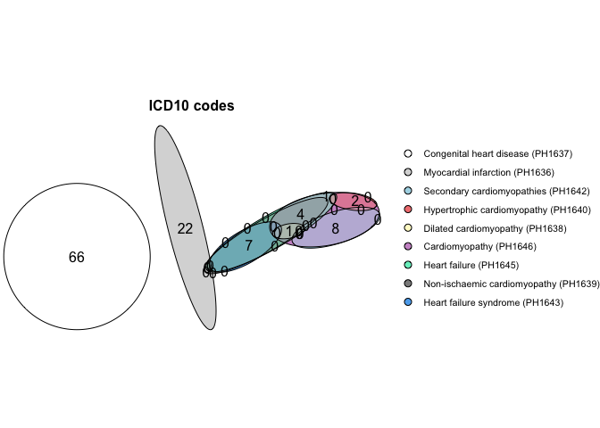
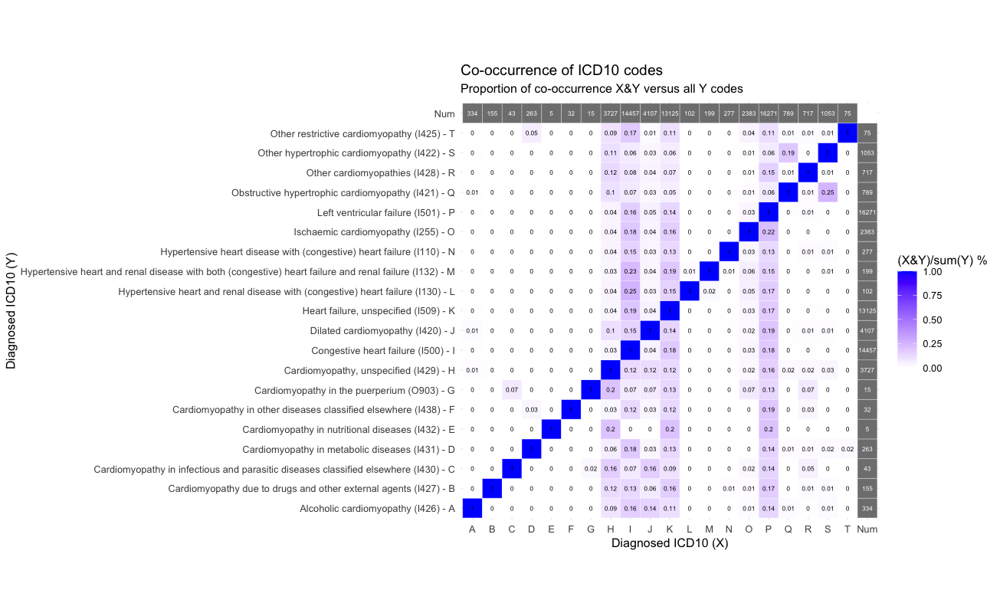

```{r, include = FALSE}
knitr::opts_chunk$set(
  collapse = TRUE,
  comment = "#>"
)
```


```{r setup}
library(heRmes)
```

---

### Example phenotyping of UKBB data
Phenotyping of the UK biobank hospital admissions data. 

```{r ukbb_datapath, include=FALSE, eval=FALSE}
file_path <- "/Users/xx20081/Desktop/hesin_diag.txt"
```
```{r plot_hermes_ukbb, eval=FALSE}
pheno_ukbb <- phenotype(file_path, 
                        id_col    = "eid", 
                        code_cols = list("ICD10 codes" = "diag_icd10", "ICD9 codes" = "diag_icd9"),
                        include   = list(HF  = "PH1645", CM = "PH1646"), 
                        exclude   = list(congHD = "PH1637", MI = "PH1636", HCM = "PH1640"), 
                        gsub      = list("\\.", "", c("x")),
                        name      = "Heart Failure")

plot(eulerr::euler(pheno_ukbb[, mget(names(pheno_ukbb)[!names(pheno_ukbb) %in% c("eid", "none")])], shape = "circle"),
          quantities = TRUE,
          labels     = FALSE,
          main       = list(label = "UKBB Heart failure phenotyping", fontsize = 8, font = 2),
          legend     = list(fontsize = 8))
```


---

### Plot the ICD-10 HERMES phenotypes
Plot the overlap of the HERMES phenotypes with all other heart failure phenotypes in the UKHDR Phenotype library.

```{r plot_hermes, eval=FALSE}
plot_code_overlap(pheno_ids = hermes_phenos, types = c("ICD10 codes"))
```


---

### Co-occurrence of UKBB ICD-10 codes
Co-occurrence matrix of heart failure (PH1645) and cardiomyopathy (PH1646) codes.
```{r cooccurrence, include=FALSE, eval=FALSE}
hf_codes <- get_codes("PH1645")
# cm_codes <- get_codes("PH1647")
codes <- rbind(hf_codes) #, cm_codes)
codes <- codes[coding_system.name == "ICD10 codes", ]
file_path <- "/Users/xx20081/Desktop/hesin_diag.txt"
dat <- data.table::fread(file_path)
dat <- dat[diag_icd10 %in% codes$code, ]
dat[codes, description := i.description, on = c("diag_icd10" = "code")]

V <- crossprod(table(unique(dat[, .(eid, description)]))) |> as.matrix()
N <- rowSums(V)
diag(V) <- N
V <- apply(V, 2, function(x) x / matrix(diag(V), ncol = 1))
diag_names <- data.table::data.table(description = colnames(V))
diag_names[dat, code := i.diag_icd10, on = "description"]
diag_names <- paste0(diag_names$description, " (", diag_names$code, ")")
V <- cbind(V, N)
V <- rbind(V, c(t(N), 0))
MORE_LETTERS <- c(LETTERS, paste0("A", LETTERS))
rownames(V) <- c(paste0(diag_names, " - ", MORE_LETTERS[1:length(diag_names)]), "Num")
colnames(V) <- c(MORE_LETTERS[1:length(diag_names)], "Num")
Vmelt <- reshape2::melt(V) |> data.table::as.data.table()
names(Vmelt) <- c("ICD10_1", "ICD10_2", "value")

# Plot 
ggplot(Vmelt, aes(x = ICD10_2, y = ICD10_1, fill = value, label = round(value, 2))) +
  geom_tile(color = "white") +
  geom_text(size = 2, aes(color = grepl("Num", ICD10_1) | grepl("Num", ICD10_2)), show.legend = FALSE) + 
  scale_fill_gradient(low = "white", high = "blue", limits = c(0, 1)) + 
  scale_color_manual(values = c("TRUE" = "white", "FALSE" = "black")) +
  theme_minimal() +
  labs(x = "Diagnosed ICD10 (X)", y = "Diagnosed ICD10 (Y)", 
       title = "Co-occurrence of ICD10 codes", 
       subtitle = "Proportion of co-occurrence X&Y versus all Y codes",
       fill = "(X&Y)/sum(Y) %") +
  coord_fixed() 
```


---
